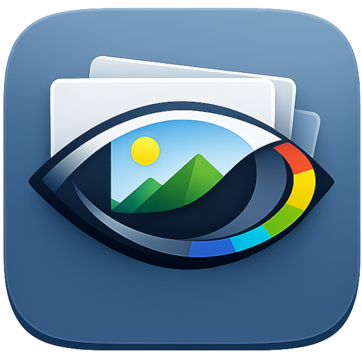

<p align="center">
  
</p>

# losles

**losles** is a small, color-managed photo viewer for Ubuntu 24.04 and later,
with native Windows support under active development. It currently displays
JPEG and PNG files and performs lossless rotation and cropping for JPEGs and
common 8-bit PNG encodings.

The application is deliberately written in C17. On Ubuntu this avoids a
language runtime, an async executor, and format frameworks that would overlap
with functionality losles needs to control itself. GTK 4 supplies the native
desktop integration, LittleCMS performs color conversion, and libjpeg-turbo
and libpng decode pixels. On Linux, colord supplies the selected monitor
profile; on Windows, losles obtains it from the Win32 color-management API.

## Why losles?

Because every other photo viewer was missing something I considered a
must-have, while providing a lot of clutter I did not need. This one focuses
on ICC profile support, lossless operations, speed (pre-loading),
and not much more.

## What works

- Embedded JPEG `ICC_PROFILE` data, including profiles split over multiple
  APP2 markers.
- Embedded PNG `iCCP` profiles.
- Application-side conversion from the embedded image profile to the ICC
  profile selected for the current monitor in Ubuntu Settings or Windows
  Color Management.
- Wide-gamut RGB display profiles. Output values are encoded directly in the
  monitor profile's RGB space; the image is not collapsed to sRGB first.
- Correct display of all eight EXIF orientation values.
- Lossless JPEG rotation and MCU-aligned cropping through libturbojpeg, while
  preserving JPEG marker metadata including ICC, EXIF, XMP, IPTC, comments,
  and unknown APP markers.
- Pixel-lossless rotation and exact-pixel cropping for static, non-interlaced,
  8-bit grayscale, grayscale-alpha, RGB, and RGBA PNGs. Original ancillary
  chunks, including `iCCP`, text, and physical-resolution data, are retained
  byte-for-byte.
- Explicit lossless EXIF-orientation normalization: the displayed orientation
  is baked into JPEG coefficients and the existing orientation tag is set to
  `1`.
- Fast previous/next navigation. losles decodes and color-converts up to five
  images on either side in the background, prioritizing nearby images and the
  current navigation direction. Decoded sources and display-profile textures
  have separate cache limits of 10% of total system memory each, with at most
  two background decodes and two background color conversions at once.
- A format-module interface. JPEG and PNG are separate GObject
  implementations, so another decoder/editor does not need changes to the
  window or color pipeline.

Images without an embedded profile are treated as sRGB. Grayscale PNG files
without a profile use a D65 gamma-2.2 gray profile. If no selected monitor ICC
profile can be found, losles uses an explicit sRGB display fallback and says
so in the information overlay.

## Ubuntu 24.04 build

All dependencies are in the standard Ubuntu repositories:

```sh
sudo apt install \
  build-essential pkg-config \
  libgtk-4-dev liblcms2-dev libcolord-dev \
  libjpeg-dev libturbojpeg0-dev libpng-dev

make
make test
./build/losles /path/to/photo.jpg
```

The Makefile uses `pkg-config` to find the system libraries and writes all
output under `build` by default. Installation follows the usual Make
variables and honors `DESTDIR`:

```sh
sudo make install                 # prefix=/usr/local by default
make DESTDIR=/tmp/losles-stage install
```

For AddressSanitizer and UndefinedBehaviorSanitizer, use a separate output
directory because Make does not track changes to compiler flags:

```sh
make BUILD_DIR=build-asan \
  SANITIZE=address,undefined \
  test
```

Run `make help` for the available targets and overrides.

## Windows development build

The native Windows port currently targets 64-bit Windows 10 and 11 using
GTK's Win32 backend and the MSYS2 UCRT64 environment. Install MSYS2, open its
**UCRT64** shell, and install:

```sh
pacman -S --needed \
  git make \
  mingw-w64-ucrt-x86_64-gcc \
  mingw-w64-ucrt-x86_64-pkgconf \
  mingw-w64-ucrt-x86_64-gtk4 \
  mingw-w64-ucrt-x86_64-lcms2 \
  mingw-w64-ucrt-x86_64-libjpeg-turbo \
  mingw-w64-ucrt-x86_64-libpng

make
make test
./build/losles.exe /path/to/photo.jpg
```

The Makefile detects the MinGW target from the compiler, omits colord, selects
the Win32 platform implementation, adds `.exe` automatically, and embeds the
multi-resolution Windows application icon with `windres` from the GCC
toolchain.

The tag-triggered GitHub Actions workflow performs the same native build on a
Windows runner. It adds the UCRT64 NSIS package, assembles only the recursive
runtime DLL dependency closure of losles and its JPEG/PNG GTK image loaders,
and compresses that staged tree into one installer:

```text
losles-<version>-windows-x86_64-setup.exe
```

The installer uses a per-user location under
`%LOCALAPPDATA%\Programs\losles`, so it does not request administrator
privileges. It creates a Start Menu shortcut, appears in Apps & Features, and
registers losles as an available JPEG/PNG handler without replacing the
user's chosen default viewer. The workflow silently installs and uninstalls
the result as a smoke test before publishing it with the corresponding
release.

GTK 4 reads the symbolic SVG subset used by its Adwaita icons itself, so the
general-purpose librsvg GdkPixbuf loader is not included. The installer is
currently unsigned and can therefore trigger a Windows SmartScreen warning.

## Versioning and tagged builds

losles uses calendar versions—and matching Git release tags—in the form
`YYYY.MM.N`, where `N` starts at `1` and counts releases made in that month:

```text
2026.07.1
2026.07.2
2026.08.1
```

The build obtains its version from Git. An exact clean release tag produces
`2026.07.1`; later commits produce a version such as
`2026.07.1+3.g1a2b3c4d5e6f`, and a modified worktree adds `.dirty`. A checkout
with no reachable release tag uses `0+untagged.g<commit>`. Use
`make print-version` to see the value that will be compiled into the About
window.

Builds without Git metadata, such as distribution source packages, can
provide the version explicitly:

```sh
make VERSION=2026.07.1
```

`0+unknown` is reserved for a source tree which genuinely has no `.git`
metadata. If metadata exists but Git cannot read it—for example because Git's
repository-ownership protection rejects a mounted directory—the version
script reports the Git error and fails instead of silently embedding an
unknown version.

The GitHub Actions tagged-build workflow runs only for pushed tags matching
the release-tag shape. It validates the month and release counter once, then
compiles and tests independently in clean Ubuntu 24.04, Ubuntu 26.04, and
Debian 13 containers. Each target exercises a staged `/usr` installation as a
smoke test and produces a native `.deb`. The raw installation trees are not
uploaded because the packages already contain those files together with
dependency, ownership, upgrade, and removal metadata. In parallel, a Windows
2025 runner builds and tests the UCRT64 application, creates the x86-64 NSIS
installer, and verifies a silent install/uninstall cycle.

The convenience packages have target-qualified versions derived from the tag:

```text
2026.07.1-0losles1~ubuntu24.04.1
2026.07.1-0losles1~ubuntu26.04.1
2026.07.1-0losles1~debian13.1
```

These revisions sort below Debian's future `-1`, allowing an official
repository package to replace a GitHub build automatically. Building each
package inside its target system also lets `debhelper` generate the correct
native shared-library package names and minimum versions.

Every Linux package build validates the desktop and AppStream files and runs
Lintian. After the three Linux targets and Windows job succeed, the workflow
publishes one GitHub Release for the tag with the three `.deb` packages, the
Windows `.exe` installer, and one `SHA256SUMS` file covering all four package
files. GitHub supplies the corresponding source ZIP and tarball automatically.
The packages are also retained briefly as Actions artifacts so the release
job can collect them, but the Release assets are the intended downloads.

These are unsigned convenience packages rather than an APT repository.
Download the package matching the installed distribution and install it
together with its repository dependencies. For example, on Ubuntu 24.04:

```sh
sudo apt install \
  './losles_2026.07.1-0losles1~ubuntu24.04.1_amd64.deb'
```

The versioned `debian/changelog` contains a neutral `0~unreleased-1`
packaging-work entry. The workflow updates a private runner copy with `dch`;
it does not commit the generated release entry. The real Debian changelog is
updated separately when preparing an archive upload, starting with
`YYYY.MM.N-1`, the target `unstable`, and the ITP bug closure.

AppStream release history is intentionally omitted: Git tags are the
project's canonical release record.

## Lossless editing semantics

Rotation and crop are applied in place as soon as their action button is
clicked. Rotation first creates the transformed image and then overwrites the
source path; it does not create a backup in the system Trash.

Crop first creates the transformed image and a safety backup, then moves the
exact original file into the system Trash and installs the cropped file at the
original path. If the original cannot be moved to Trash, it is left unchanged
and the crop fails.

JPEG transforms operate on DCT coefficients through libturbojpeg, not by
decoding and re-encoding pixels. JPEG marker metadata is copied without
selectively rewriting or discarding fields. Ordinary left/right rotation
retains the original EXIF orientation tag. For mirrored EXIF orientations,
losles reverses the raw coefficient direction so that the result still rotates
in the direction requested on screen. A right rotation followed by a left
rotation is byte-identical for the supported perfect-transform path.

The separate warning-icon normalization button is enabled only for a JPEG
containing an EXIF orientation tag whose value is not `1`. It applies that
orientation to the coefficients and changes the existing tag to `1`, without
changing the displayed image. Its tooltip explains whether a non-default
orientation is present. Like ordinary rotation, normalization overwrites the
source without creating a Trash backup. This explicit action is useful for
software that ignores EXIF orientation and enables losles cropping afterward.

JPEG crop coordinates must start on an MCU boundary. While the rectangle is
drawn, moved, or resized, losles snaps it to the format module's nearest legal
boundaries. The visible rectangle is therefore the rectangle that will be
applied; clicking Crop does not perform a second hidden expansion. A transform
is refused when a mathematically perfect result is impossible; losles does not
silently trim edge pixels.

Metadata fields whose meaning depends on image dimensions, such as an embedded
thumbnail, EXIF pixel dimensions, or PNG metadata, are retained unchanged
rather than discarded or regenerated. They can therefore describe the
pre-edit image after a crop, a quarter-turn rotation, or orientation
normalization. The image format's own encoded dimensions are updated
correctly.

PNG transforms decode and recompress the original samples without changing
their values. The original `IHDR` and `IDAT` chunks are replaced as required;
every other original chunk is copied unchanged and in order. Editing is
enabled only for static, non-interlaced, 8-bit grayscale, grayscale-alpha,
RGB, and RGBA PNG files. Palette PNGs, sub-8-bit grayscale, 16-bit samples,
Adam7 interlacing, and animated PNG chunks remain view-only: Rotate and Crop
stay disabled rather than converting those files to a simpler representation.

## Interface

Image and color-profile information is shown on an opaque black overlay
anchored directly to the bottom-left corner of the picture, so it does not
consume layout space. It is hidden by default and can be toggled with the
information button or the `I` key. The image canvas is always pure black,
independently of the desktop color scheme and in fullscreen.

Scroll the mouse wheel over the image to zoom in or back out toward the
initial fit. The image point under the mouse remains under the mouse while
zooming, except when an image edge reaches the edge of the canvas. While
zoomed in, drag the image with the primary mouse button to inspect another
portion. Zooming scales the existing color-managed texture and does not
decode or color-convert the source again.

Double-click the picture or press `Alt+Enter` to enter or leave fullscreen.
The header bar is hidden while fullscreen is active. `Escape` does not leave
fullscreen. It first cancels Crop mode when active; otherwise it restores the
initial fitted view when zoomed in.

Press `C` to enter or leave crop mode, including while fullscreen. In crop
mode, drag over the image to create a selection. Drag inside an existing
selection to move it, or drag any of its four edges or eight visible
edge/corner handles to resize it. JPEG selections move in legal MCU-block
increments, while supported PNGs use exact pixels, so the overlay always
previews the crop that will be written. Press `Enter` to apply a valid
selection. The header control uses a crop-corner glyph supplied by losles, so
it does not depend on the desktop icon theme. Entering Crop mode restores the
fitted view; wheel zoom and image panning are inactive until Crop mode is
left.

Use the warning-icon orientation control when it is enabled to bake a
non-default EXIF orientation into the JPEG coefficients and set the tag to
`1`. The image keeps the same visual orientation, and the operation is
coefficient-lossless.

Press `Delete` to move the current image to the system Trash. losles then
opens the next image in directory order when one exists. When the deleted
image was last, it opens the preceding image, which is now last. It clears the
browsing session and displays “No picture opened” only when the directory has
no supported images left.

An image file can also be opened by dragging its file icon from a file manager
onto the losles window. A multi-file drop opens the first file. File drops
are rejected while Crop mode or another file operation is active. After an
accepted drop, losles takes keyboard focus so its navigation and other
shortcuts work immediately.

The question-mark About button in the header bar opens a single-page window
with application, version, creator, license, and source-repository
information, with a link to
`https://github.com/develancer/losles`.

When opening or navigating to another image, losles keeps the currently
displayed image on screen with a large centered loading spinner until the new
image has been decoded and color-converted. The initial load uses the black
canvas because no previous image is available. If both the decoded image and
its display-profile-converted texture are already cached, losles switches to
it immediately without showing the spinner.

## Color-management model

losles performs SDR display conversion itself on both supported platforms.
It requires an RGB monitor profile, converts directly from the image's
embedded profile with LittleCMS, and falls back visibly to sRGB if the
selected display profile cannot be found or used.

### Ubuntu 24.04

losles does not depend on Mutter's newer color-management protocol. GTK 4.14
on Ubuntu 24.04 cannot attach an ICC colorspace to a surface, so losles uses
the established application-managed path:

1. Obtain the active `GdkMonitor` and its connector name (for example
   `DP-0`).
2. Find the corresponding colord display device by its `XRANDR_name`
   metadata.
3. Read that device's selected/default RGB profile.
4. Use LittleCMS to convert the decoded source pixels from their embedded
   profile directly into the monitor profile.
5. Give those already converted device-RGB values to GTK 4.14.

Moving the window to another monitor or changing the device's selected
profile invalidates the current transform and rebuilds the visible texture.
Calibration curves (VCGT) remain the desktop color service's responsibility
and are not applied a second time by losles.

This design targets the Ubuntu 24.04 SDR desktop pipeline. It supports the
gamut described by an RGB monitor ICC profile, but it is not an HDR
implementation. On a future compositor that color-transforms every surface,
losles will need a second backend that tags source pixels instead of
preconverting them; otherwise conversion could be applied twice.

### Windows

The GTK Win32 surface exposes the native window handle. losles uses it to
identify the monitor containing the window, creates that display's device
context, and asks `GetICMProfileW` for its current output ICC profile. The
same LittleCMS rendering pipeline then produces device-RGB pixels for that
profile. Moving to another monitor starts a new render, and the profile path
and file metadata are rechecked whenever rendering starts.

Windows does not currently notify `LoslesColorManager` when the selected
profile changes while the same image remains idle. Navigating, moving the
window between monitors, or otherwise starting a render rechecks it. Like the
Ubuntu path, this is wide-gamut SDR support with 8-bit output, not HDR.

## Source layout

```text
data/
  icons/hicolor/512x512/apps/
    io.github.develancer.losles.png  installed application icon
  icons/windows/
    io.github.develancer.losles.ico  native multi-resolution Windows icon
  io.github.develancer.losles.desktop
  io.github.develancer.losles.metainfo.xml
  losles.1                    command-line manual page
debian/
  control                     Debian build and binary package metadata
  rules                       debhelper bridge to the upstream Makefile
  copyright                   machine-readable licensing
  changelog                   Debian package version and upload history
tools/
  version.sh                  Git tag validation and build-version derivation
  copy-pe-runtime.sh          recursive Windows runtime-DLL collection
packaging/windows/
  COPYING.rtf                  Windows installer rendering of the MIT license
  losles.rc                   embeds the native icon in losles.exe
  losles.nsi                  per-user NSIS installer and uninstaller
.github/workflows/
  tagged-build.yml            tagged Linux/Windows builds and release publishing
src/
  losles-config.h             application identity and repository URL
  losles-window.c             UI, navigation, two-level cache, background jobs
  losles-cache-policy.c       cache ordering, admission, and eviction policy
  losles-color-manager.c      platform display profile lookup and LCMS render
  losles-platform.h           OS integration boundary
  losles-platform-linux.c     sysinfo, GIO Trash, POSIX hard links/permissions
  losles-platform-win32.c     memory, Recycle Bin, Win32 hard links/icon path
  losles-image.c              format-neutral decoded image
  formats/
    losles-format.c           module interface
    losles-format-registry.c  format selection
    losles-jpeg-format.c      JPEG decode and lossless writer
    losles-png-format.c       PNG decode, capability checks, and lossless writer
tests/
  test-cache-policy.c         cache ordering and memory-admission regression tests
  test-jpeg-metadata.c
  test-formats.c              ICC/render, JPEG/PNG edits, and Trash integration
```

Current deliberate limits are RGB/grayscale JPEG and PNG viewing, editing of
JPEG plus the common PNG subset described above, 8-bit display buffers, SDR
ICC profiles, and local files for editing. CMYK JPEG display is not
implemented yet. Windows packaging currently produces an unsigned per-user
NSIS installer; Authenticode signing is still future release work.

## License

losles is distributed under the MIT License. This includes the application
icon. The AppStream metadata is separately dedicated under CC0-1.0 so
software catalogues and distributions can reuse it freely. See `COPYING` and
the SPDX declaration in the metadata file.
